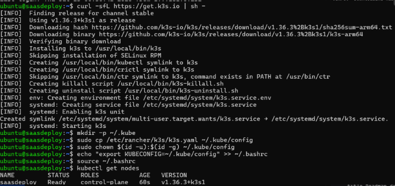
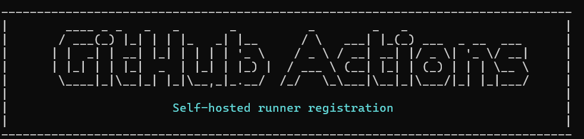

# ☸️ guardrails-edge-infra

> **GitOps & Platform Engineering**: Lightweight Kubernetes cluster (K3s) hosted on ARM64 hardware (Oracle Cloud 12GB RAM Free Tier) serving the **NVIDIA NeMo Guardrails Server**, **Granite Guardian 2B Local Classifier**, **PostgreSQL**, and **FastMCP Server**.

---

## 📖 Extended Documentation
- 📄 **[Technical K3s Deployment Specification](./docs/k3s-deployment-details.md)**
- 🤖 **[GitHub Actions Self-Hosted Runner & Operations Guide](./docs/github-actions-runner-guide.md)**
- 🐘 **[PostgreSQL Database & Schema Operations Guide](./docs/database-operations-guide.md)**

---

## 🔬 Local Specialized Risk Classifier: Granite Guardian 2B

Rather than invoking an expensive generalist LLM (like GPT-4o) for simple safety checks, our architecture runs a **specialized local classifier** directly inside the K3s cluster:

- **Model**: **IBM Granite Guardian 2B** (Fine-tuned version of Granite 3.1 2B Instruct specialized in risk taxonomy: jailbreak, harm, off-topic, hallucination & groundedness).
- **Behavior**: Responds exclusively with binary `Yes` / `No` classification output.
- **FinOps Advantage**: Evaluates Input and Output Rails locally on the ARM node (~1.8GB RAM allocated), eliminating main LLM token costs for blocked prompts.

---

## 🏛️ 1. Architecture Decisions & Technical Trade-offs

### ❓ Why K3s instead of Traditional Upstream Kubernetes (EKS / GKE / K8s)?

In an edge infrastructure environment with strict hardware memory constraints (12GB RAM on Oracle Cloud Free Tier), choosing the right Kubernetes distribution was critical to guarantee sufficient memory allocation for AI models and microservices:

| Engineering Metric | Traditional Kubernetes (K8s / etcd) | K3s (CNCF Certified Lightweight) | Staff Engineering Decision |
|---|---|---|---|
| **Control Plane RAM Consumption** | ~2.5 GB to 4.0 GB RAM (separate etcd + kube-apiserver) | **~512 MB RAM** (Embedded SQLite / Raft) | 🏆 **K3s saves >3.0 GB RAM** which is directly allocated to NeMo Server, Granite Guardian 2B, and FastMCP. |
| **Binary Footprint** | Dozens of binaries & heavy OS dependencies | **Single lightweight binary (<100MB)** | Instant & idempotent bootstrap on ARM64 nodes. |
| **API & Tooling Compatibility** | Industry standard | **100% CNCF Certified API** | Native support for standard K8s manifests (`kubectl apply`, Kustomize, PVCs, Ingress, Secrets). |
| **Trade-off / Constraint** | High Availability across thousands of multi-AZ nodes | Single-node control plane by default | 💡 **Accepted Trade-off**: For edge/staging PoCs and enterprise demos, a single-node K3s eliminates operational overhead. Migrating to production EKS is 100% seamless without changing application YAMLs. |

---

## 📸 2. Infrastructure Evidence & Deployment Screenshots

### ✅ Evidence 1: Bootstrap of K3s ARM64 Cluster (`v1.36.3+k3s1`)
The K3s cluster was provisioned on the `saasdeploy` ARM64 node with an active control plane and non-root `kubectl` credentials.



---

### ✅ Evidence 2: GitHub Actions Self-Hosted Runner Service (`saasdeploy`)
The runner was registered under the `Default` group and configured as a persistent `systemd` daemon, enabling secure zero-downtime GitOps deployments directly on the node without exposing port 6443 to the public internet.



---

## 🛠️ 3. K3s Manifests & Directory Structure (GitOps)

```text
guardrails-edge-infra/
├── .github/
│   └── workflows/
│       └── deploy.yml               # GitOps pipeline executing on self-hosted runner
├── docs/
│   ├── k3s-deployment-details.md    # In-depth technical specification
│   ├── github-actions-runner-guide.md # CI/CD & runner management guide
│   └── database-operations-guide.md # PostgreSQL queries & maintenance guide
├── k3s/
│   ├── namespace.yaml               # 'guardrails' namespace
│   ├── guardian/
│   │   └── deployment.yaml          # IBM Granite Guardian 2B Local Classifier (Ollama)
│   ├── postgres/
│   │   ├── deployment.yaml          # PostgreSQL tuned for low RAM (~350MB)
│   │   ├── service.yaml
│   │   └── configmap-seed.yaml      # Seeds: characters, blocked_pix_keys, transactions
│   ├── nemo-guardrails/
│   │   ├── deployment.yaml          # NVIDIA NeMo Guardrails FastAPI Server
│   │   ├── service.yaml
│   │   └── configmap-policy.yaml    # Policy-as-Code (config.yml + rails.co)
│   └── kustomization.yaml           # Kustomize orchestrator
├── images/
│   ├── k3s_install.png              # K3s installation proof
│   └── git_actions_runner_config.png # GitHub Actions runner registration proof
└── README.md
```

---

## 🔄 4. Continuous Integration & GitOps Deployment Pipeline

This repository leverages a **GitHub Actions Self-Hosted Runner** running as a `systemd` background service on the `saasdeploy` node.

Every push to the `main` branch automatically triggers the following pipeline:
```bash
kubectl apply -k k3s/
```
No public API server exposure (port 6443 remains internal), enforcing zero-trust security practices.
