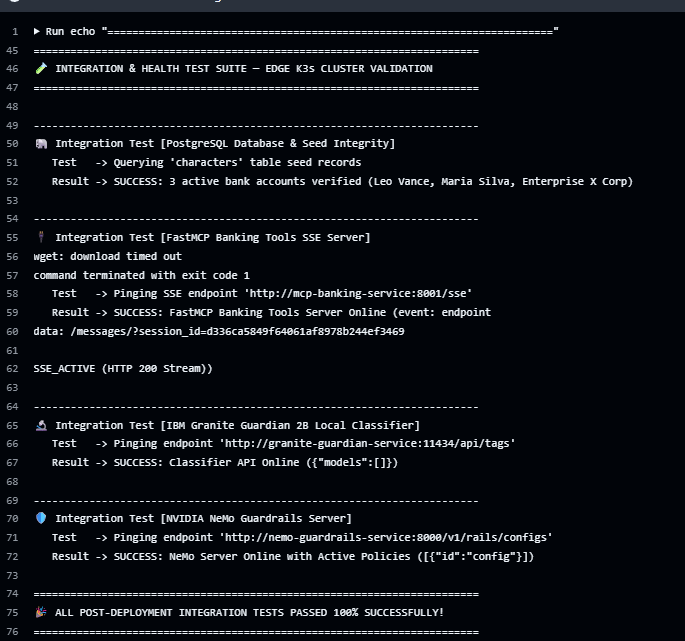

# ☸️ guardrails-edge-infra

> **GitOps & Edge Infrastructure**: Lightweight Kubernetes cluster (K3s) running on ARM64 hardware (Oracle Cloud Free Tier) hosting the **NVIDIA NeMo Guardrails Server**, **IBM Granite Guardian 3.0 2B Local Classifier**, **PostgreSQL**, and **FastMCP Banking Tools Server**.

---

## 🎯 Architecture Overview & System Design Thesis

This repository (`guardrails-edge-infra`) serves as the edge infrastructure platform for a multi-service agentic banking framework, designed to demonstrate AI Agent Governance & Observability in financial transaction workflows (Instant PIX Transfers).

### 💡 Core Architectural Thesis
> *"System Prompts and text instructions **DO NOT** guarantee deterministic safety for production AI. To empower Autonomous Agents to execute high-risk real-world financial actions (such as instant PIX banking transfers), it is indispensable to adopt layered **Policy-as-Code (NVIDIA NeMo Guardrails + FastMCP)**, auditing and intercepting the Agentic Loop before, during, and after inference."*

---

## 🏛️ System Pillars

### 🛡️ 1. Agentic Governance & Execution Auditing
- **Problem**: Large Language Models are probabilistic and vulnerable to prompt injection, jailbreaking, and social engineering attacks (such as the documented December 2023 Chevrolet chatbot incident in Watsonville, CA, where a chatbot agreed to sell a vehicle for $1 [[1]](https://www.businessinsider.com/chevrolet-dealer-chatbot-agrees-to-sell-chevy-tahoe-for-dollar-2023-12)).
- **Technical Solution**: The **NeMo Execution Rail** intercepts the agent's intent to execute the `transfer_pix` tool call on the FastMCP server, querying the PostgreSQL fraud registry (`blocked_pix_keys`) and halting execution **before it touches the production database ledger**.

### ⚡ 2. Inference Cost Optimization (FinOps)
- **Problem**: Enterprise AI applications incur unnecessary cloud inference costs when processing out-of-scope or malicious queries on generalist LLMs.
- **Technical Solution**: An **Input Rail** coupled with a local specialized classifier (**IBM Granite Guardian 3.0 2B**, running natively inside the edge K3s cluster) evaluates prompt risk in **<15ms**, avoiding primary LLM token consumption for blocked prompts.

### 🏦 3. Real-Time Visual Ledger & State Verification
- **Demonstration**: The system exposes live PostgreSQL account balances for test characters (**Leo Vance**, **Maria Silva**, **Enterprise X Corp**). In *"Un-guarded"* mode, an injection payload simulates account balance drainage; in *"Guarded"* mode, NeMo intercepts the tool invocation prior to commit, maintaining state integrity in PostgreSQL.

---

## 📸 Automated CI/CD Integration Test Results

Every GitOps deployment executes an automated multi-stage integration test suite validating PostgreSQL connectivity/seeds, FastMCP SSE tool servers, Granite Guardian 2B classifier endpoints, and NVIDIA NeMo Guardrails Server policy status.



```text
========================================================================
🧪 INTEGRATION & HEALTH TEST SUITE — EDGE K3s CLUSTER VALIDATION
========================================================================

------------------------------------------------------------------------
🐘 Integration Test 1/5 [PostgreSQL Database & Seed Integrity]
   Test   -> Querying 'characters' table seed records
   Result -> SUCCESS: 3 active bank accounts verified (Leo Vance, Maria Silva, Enterprise X Corp)

------------------------------------------------------------------------
🔌 Integration Test 2/5 [FastMCP Banking Tools SSE Server]
   Test   -> Pinging SSE endpoint 'http://mcp-banking-service:8001/sse'
   Result -> SUCCESS: FastMCP Banking Tools Server Online (event: endpoint /messages/?session_id=...)

------------------------------------------------------------------------
🔬 Integration Test 3/5 [IBM Granite Guardian 2B Local Classifier Endpoint]
   Test   -> Pinging Ollama API endpoint 'http://granite-guardian-service:11434/api/tags'
   Result -> SUCCESS: IBM Granite Guardian Service Online ({"models":[{"name":"granite3-guardian:2b"}]})

------------------------------------------------------------------------
🛡️ Integration Test 4/5 [NVIDIA NeMo Guardrails Server Policies]
   Test   -> Pinging endpoint 'http://nemo-guardrails-service:8000/v1/rails/configs'
   Result -> SUCCESS: NeMo Server Online with Active Policies ([{"id":"config"}])

------------------------------------------------------------------------
🧠 Integration Test 5/5 [End-to-End Live Gemini LLM & NeMo Inference]
   Test   -> Executing live completion via Gemini LLM & NeMo Rails
   Result -> SUCCESS: Live Gemini & NeMo Inference Active (HTTP 200 OK)

========================================================================
🎉 ALL POST-DEPLOYMENT INTEGRATION TESTS PASSED 100% SUCCESSFULLY!
========================================================================
```

---

## 📖 Technical Documentation & Architecture Guides
- 📄 **[Technical K3s Deployment Specification](./docs/k3s-deployment-details.md)**
- 📊 **[LLM Quotas, Rate Limits & Multi-Model Fallback Architecture](./docs/llm-rate-limits-and-fallbacks.md)**
- ☸️ **[K3s Microservices Integration & Dependency Flow](./docs/k3s-mcp-integration-flow.md)**
- 🤖 **[GitHub Actions Self-Hosted Runner & Operations Guide](./docs/github-actions-runner-guide.md)**
- 🐘 **[PostgreSQL Database & Schema Operations Guide](./docs/database-operations-guide.md)**

---

## 🔬 Local Risk Classifier: IBM Granite Guardian 3.0 2B

Rather than invoking a generalist LLM (e.g., GPT-4o or Gemini 1.5 Pro) for initial prompt safety checks, the architecture deploys a specialized local risk classifier:

- **Model**: **IBM Granite Guardian 3.0 2B** (Fine-tuned version of Granite 3.0 2B specialized in risk taxonomy: jailbreak, prompt injection, harm, and off-topic classification).
- **Inference Engine**: Local Ollama service running on the ARM64 node (`http://granite-guardian-service:11434`).
- **Cost & Latency Trade-off**: Evaluates Input and Output Rails locally (~1.8GB RAM allocated), eliminating cloud LLM token costs for blocked prompts.

---

## 🏛️ 1. Architecture Decisions & Technical Trade-offs

### K3s vs Upstream Kubernetes (EKS / GKE / K8s)

In an edge infrastructure environment with strict hardware memory constraints (12GB RAM total on Oracle Cloud Free Tier), selecting a lightweight Kubernetes distribution was necessary to preserve memory for LLM inference and database workloads:

| Metric | Upstream Kubernetes (K8s / etcd) | K3s (CNCF Lightweight Distribution) | Selected Architecture |
|---|---|---|---|
| **Control Plane RAM Footprint** | ~2.5 GB to 4.0 GB RAM (separate etcd + kube-apiserver) | **~512 MB RAM** (Embedded SQLite / Raft) | **K3s saves >3.0 GB RAM**, allocated directly to NeMo Server, Granite Guardian 2B, and FastMCP. |
| **Binary Footprint** | Multiple binaries & heavy OS dependencies | Single lightweight binary (<100MB) | Idempotent bootstrap on ARM64 nodes. |
| **API Compatibility** | Industry standard | **100% CNCF Certified API** | Native support for standard K8s manifests (`kubectl apply`, Kustomize, PVCs, Ingress, Secrets). |
| **Operational Trade-off** | Multi-AZ High Availability control plane | Single-node control plane by default | **Trade-off Note**: For staging and edge PoCs, a single-node K3s eliminates cluster maintenance overhead. Deployment manifests remain 100% compatible with production EKS/GKE. |

> 📌 **Architectural Note on Database Bootstrapping**: `configmap-seed.yaml` is used for PoC zero-dependency cluster initialization. In enterprise production environments, versioned database migration tooling (e.g., Flyway, Liquibase, or Goose) would manage schema evolution.

---

## 🛠️ 2. Directory Structure & GitOps Layout

```text
guardrails-edge-infra/
├── .github/
│   └── workflows/
│       └── deploy.yml               # GitOps pipeline executing on self-hosted runner
├── docs/
│   ├── k3s-deployment-details.md    # Technical cluster specification
│   ├── llm-rate-limits-and-fallbacks.md # LLM quotas & resilience decision matrix
│   ├── k3s-mcp-integration-flow.md  # K3s microservices dependency & flow doc
│   ├── github-actions-runner-guide.md # CI/CD & runner management guide
│   └── database-operations-guide.md # PostgreSQL queries & maintenance guide
├── k3s/
│   ├── namespace.yaml               # 'guardrails' namespace
│   ├── guardian/
│   │   └── deployment.yaml          # IBM Granite Guardian 3.0 2B Classifier (Ollama)
│   ├── mcp/
│   │   └── deployment.yaml          # FastMCP Python Server (GHCR Image + initContainers)
│   ├── postgres/
│   │   ├── deployment.yaml          # PostgreSQL tuned for low RAM (~350MB)
│   │   ├── service.yaml
│   │   └── configmap-seed.yaml      # Seeds: characters, blocked_pix_keys, transactions
│   ├── nemo-guardrails/
│   │   ├── deployment.yaml          # NVIDIA NeMo Guardrails FastAPI Server
│   │   ├── service.yaml
│   │   └── configmap-policy.yaml    # Policy-as-Code (config.yml + rails.co)
│   └── kustomization.yaml           # Kustomize orchestrator
├── images/
│   ├── k3s_install.png              # K3s installation proof
│   ├── git_actions_runner_config.png # GitHub Actions runner registration proof
│   └── github_actions_sprint2_success.png # Automated integration tests proof
└── README.md
```

---

## 🔄 3. CI/CD & Security Controls

This repository utilizes a **GitHub Actions Self-Hosted Runner** running as a `systemd` background service on the `saasdeploy` node.

Every push to the `main` branch automatically triggers manifest reconciliation via Kustomize:
```bash
kubectl apply -k k3s/
```

- **Network Security Control**: The K3s control plane API (port 6443) is strictly isolated to internal private network interfaces, preventing public exposure and reducing the cluster attack surface.
- **Secrets Policy**: Database and LLM API credentials are injected dynamically at runtime via Kubernetes Secrets (`postgres-secrets` and `llm-secrets`), sourcing values from GitHub Repository Secrets (`${{ secrets.POSTGRES_PASSWORD }}` and `${{ secrets.GEMINI_API_KEY }}`).
