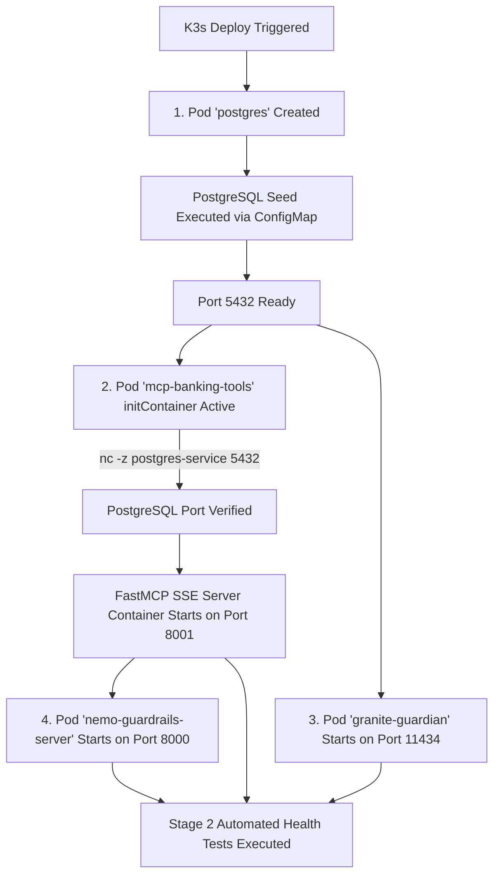

# ☸️ K3s Microservices Integration & Dependency Flow
## Repository: `guardrails-edge-infra`

This document details how the microservices (`PostgreSQL`, `mcp-banking-tools`, `IBM Granite Guardian 2B`, and `NVIDIA NeMo Guardrails Server`) interact inside the `guardrails` namespace in K3s.

---

## 🔄 1. Pod Initialization Dependency Order (`initContainers`)

To prevent startup race conditions (where an application attempts to connect to PostgreSQL before database initialization completes), the cluster manifests enforce explicit initialization ordering:

---

## 🛡️ 2. Microservice Ports & Service DNS Registry

All microservices communicate internally over Kubernetes ClusterIP Service DNS without exposing public node ports:

| Microservice Pod | K3s Service Name | Internal DNS URI | Protocol / Port |
|---|---|---|---|
| **PostgreSQL 16** | `postgres-service` | `postgres-service.guardrails.svc.cluster.local` | TCP / `5432` |
| **FastMCP Tools** | `mcp-banking-service` | `mcp-banking-service.guardrails.svc.cluster.local` | HTTP SSE / `8001` |
| **Granite Guardian 2B** | `granite-guardian-service` | `granite-guardian-service.guardrails.svc.cluster.local` | HTTP REST / `11434` |
| **NeMo Server** | `nemo-guardrails-service` | `nemo-guardrails-service.guardrails.svc.cluster.local` | HTTP REST / `8000` |
